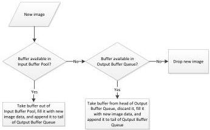
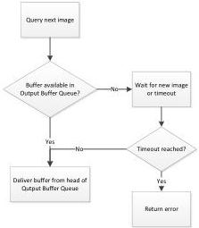

This buffer handling mode is typically used if every image frame is to be acquired and the mean processing time is lower than acquisition time. No buffer is discarded or overwritten in the Output Buffer Queue and all filled buffers are delivered in the order they were acquired.

Acquisition Engine

Buffer Delivery

Figure 3-3.2: Buffer handling mode “OldestFirstOverwrite”

- OldestFirstOverwrite (Recommended): The application always gets the buffer from the head of the Output Buffer Queue (thus, the oldest available one). If the Output Buffer Queue is empty, the application waits for a newly acquired buffer until the timeout expires.

When data for a new buffer is available, the acquisition engine looks for any available buffer in the Input Buffer Pool, fills it, and appends it to the tail of the Output Buffer Queue. If the Input Buffer Pool is empty and the Output Buffer Queue is not empty, it discards the head of the Output Buffer Queue (i.e., the oldest buffer), overwrites it with the new data, and appends it to the tail of the Output Buffer Queue. If the Input Buffer Pool and the Output Buffer Queue are empty, the new data is dropped.

This buffer handling mode is typically used if not every image frame is to be acquired and the application may not fall behind.

- NewestOnly (Recommended): The application always gets the latest completed buffer (the newest one). If the Output Buffer Queue is empty, the application waits for a newly acquired buffer until the timeout expires.