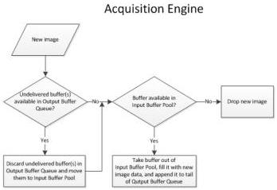
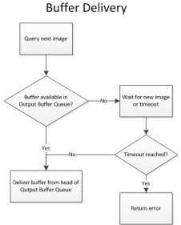

|  GEN<i>CAM |   | emva  |
| --- | --- | --- |
|  Version 1.2.0 | GenTL Standard Features Naming Convention  |   |

This buffer handling mode is typically used in a live display GUI where it is important that there is no lag between camera and display.

Figure 3-3.3. Buffer Handling Mode "Newest Only".

- Default (Deprecated): Same behavior as "OldestFirst".

Note that depending on the actual payload not only pure images, but any kind of data can be acquired.

### 3.4.3.4 StreamAnnounceBufferMinimum

|  Name | StreamAnnounceBufferMinimum  |
| --- | --- |
|  Category | BufferHandlingControl  |
|  Level | Mandatory  |
|  Interface | IInteger  |
|  Access | Read  |
|  Unit | -  |
|  Visibility | Expert  |
|  Values | ≥0  |

Minimal number of buffers to announce to enable selected buffer handling mode.

Corresponds to the STREAM_INFO_BUF_ANNOUNCE_MIN command of DSGetInfo function.