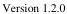

|  CAM |   | emva  |
| --- | --- | --- |
|  Version 1.2.0 | GenTL Standard Features Naming Convention  |   |

2.3.5 Event Control 32

2.4 DATA STREAM MODULE 33

2.4.1 Stream Information 33

2.4.2 Device Stream Channel Control 33

2.4.3 Buffer Handling Control 34

2.4.4 GenICam Control 35

2.4.5 Event Control 35

2.5 BUFFER MODULE 37

2.5.1 Buffer Information 37

2.5.2 Buffer Data Information 37

2.5.3 GenICam Control 37

3 GENERAL FEATURES 41

3.1 SYSTEM MODULE 41

3.1.1 System Information 41

3.1.1.1 SystemInformation 41

3.1.1.2 TLID 41

3.1.1.3 TLVendorName 42

3.1.1.4 TLModelName 42

3.1.1.5 TLVersion 43

3.1.1.6 TLFileName 43

3.1.1.7 TLDisplayName 43

3.1.1.8 TLPath 44

3.1.1.9 TLType 44

3.1.1.10 GenTLVersionMajor 46

3.1.1.11 GenTLVersionMinor 46

3.1.1.12 GenTLSFNCVersionMajor 47

3.1.1.13 GenTLSFNCVersionMinor 47

3.1.1.14 GevVersionMajor (Deprecated) 47

3.1.1.15 GevVersionMinor (Deprecated) 48

3.1.2 Interface Enumeration 48

3.1.2.1 InterfaceEnumeration 49

3.1.2.2 InterfaceUpdateList 49

3.1.2.3 InterfaceUpdateTimeout 49

3.1.2.4 InterfaceSelector 50

3.1.2.5 InterfaceID 50