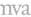

|   GEN<i>CAM |   |  emva  |
| --- | --- | --- |
|  Version 1.2.0 | GenTL Standard Features Naming Convention  |   |

|  Interface | IInteger  |
| --- | --- |
|  Access | Read/Write  |
|  Unit | -  |
|  Visibility | Expert  |
|  Values |   |

The Action Command Device Key to use in the Action Command.

##### 3.2.3.4 ActionGroupKey

|  Name | ActionGroupKey  |
| --- | --- |
|  Category | ActionControl  |
|  Level | Recommended  |
|  TLType | GigEVision  |
|  Interface | IInteger  |
|  Access | Read/Write  |
|  Unit | -  |
|  Visibility | Expert  |
|  Values |   |

The Action Command Group Key to use in the Action Command.

##### 3.2.3.5 ActionGroupMask

|  Name | ActionGroupMask  |
| --- | --- |
|  Category | ActionControl  |
|  Level | Recommended  |
|  TLType | GigEVision  |
|  Interface | IInteger  |
|  Access | Read/Write  |
|  Unit | -  |
|  Visibility | Expert  |
|  Values |   |