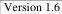

|   CAM |   |  emva  |
| --- | --- | --- |
|  Version 1.6 | GenTL Standard  |   |

implemented the DSGetBufferInfo function must return the appropriate error return value.

For multi-part buffers it is possible to query information on each part. Therefore some of the BUFFER_INFO_CMDs are not used or overwritten by BUFFER_PART_INFO_CMDs. The enumeration table below lists which commands are applicable on the global buffer if the underlying buffer contains multi-part data. In the table listing the command values the column "Global-Part/Impl" lists if a given info command is to be queried on the global buffer or if the command is over written by an info command of the image part within the buffer. The possible values are:

|  Acronym | Description  |
| --- | --- |
|  G/O | The information is to be inquired on the global buffer. Implementation of the command is recommended but optional/technology dependent.  |
|  G/M | The information is to be inquired on the global buffer. Implementation of the command is mandatory. In case a similar command is available for buffer part also the scope of the BUFFER_INFO_CMD is the global buffer where the BUFFER_PART_INFO_CMD is describing the part.  |
|  G/CM | The information is to be inquired on the global buffer. Implementation of the command is conditional mandatory. Conditional mandatory is used for commands which might not always be applicable. If it is possible to implement a certain command it must be implemented. In case a similar command is available for buffer part also the scope of the BUFFER_INFO_CMD is the global buffer where the BUFFER_PART_INFO_CMD is describing the part.  |
|  P/O | The command is not available in case the buffer contains multi-part data. In this case the function DSGetBufferInfo returns GC_ERR_NO_DATA. In case the buffer does not contain multi-part data the command returns the requested information. The implementation of the command is optional.  |
|  P/M | The command is not available in case the buffer contains multi-part data. In this case the function DSGetBufferInfo returns GC_ERR_NO_DATA. In case the buffer does not contain multi-part data the command returns the requested information. In this case the implementation of the command is mandatory .  |