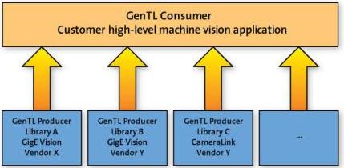

|   CAM |   | emva  |
| --- | --- | --- |
|  Version 1.6 | GenTL Standard  |   |

## 2 Architecture

This section provides a high level view of the different components of the GenICam GenTL standard.

### 2.1 Overview

The goal of GenTL is to provide an agnostic transport layer interface to acquire images or other data and to communicate with a device. It is not its purpose to configure the device except for the transport related features – even if it must be indirectly used in order to communicate configuration information to and from the device.

#### 2.1.1 GenICam GenTL

The standard text's primary concern is the definition of the GenTL Interface and its behavior. However, it is also important to understand the role of the GenTL in the whole GenICam system.

Figure 2-1: GenTL Consumer and GenTL Producer

When used alone, GenTL is used to identify two different entities: the GenTL Producer and the GenTL Consumer.

A GenTL Producer is a software driver implementing the GenTL Interface to enable an application or a software library to access and configure hardware in a generic way and to stream image data from a device.

A GenTL Consumer is any software that can use one or multiple GenTL Producers via the defined GenTL Interface. This can be for example an application or a software library.

#### 2.1.2 GenICam GenApi

It is strongly recommended not to use the GenApi module inside a GenTL Producer implementation. If it is used internally, no access to it may be given through the C interface. Some reasons are: