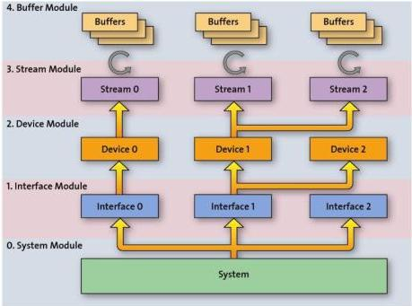

|   CAM |   |  emva  |
| --- | --- | --- |
|  Version 1.6 | GenTL Standard  |   |

Figure 2-2: GenTL Module hierarchy

#### 2.2.1 System Module

For every GenTL Consumer the System module as the root of the hierarchy is the entry point to a GenTL Producer software driver. It represents the whole system (not global, just the whole system of the GenTL Producer driver) on the host side from the GenTL libraries point of view.

The main task of the System module is to enumerate and instantiate available interfaces covered by the implementation.

The System module also provides signaling capability and configuration of the module's internal functionality to the GenTL Consumer.

It is possible to have a single GenTL Producer incorporating multiple transport layer technologies and to express them as different Interface modules. In this case the reported transport layer technology of the System module must be 'Mixed' (see chapter 6.6.1) and the child Interface modules expose their actual transport layer technology. In this case the first interface could then be a Camera Link frame grabber board and the second interface an IIDC 1394 controller.

#### 2.2.2 Interface Module

An Interface module represents one physical interface in the system. For Ethernet based transport layer technologies, this would be a Network Interface Card; for a Camera Link based implementation, this would be one frame grabber board. The enumeration and instantiation of available devices on this interface is the main role of this module. The