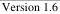

|   CAM |   |  emva  |
| --- | --- | --- |
|  Version 1.6 | GenTL Standard  |   |

the buffer size required to hold given information can be negotiated first as described for the pBuffer==NULL above.

When retrieving multiple infos through DSGetBufferPartInfoStacked call, each DS_BUFFER_PART_INFO_STACKED structure is handled independently on the others. GenTL Consumer should receive identical output (iResult and the value in pBuffer), no matter if it used single DSGetBufferPartInfoStacked or sequence of DSGetBufferPartInfo calls.

Each iResult member of the many DS_BUFFER_PART_INFO_STACKED structures represents the result of exactly one buffer part info query. The applicable error codes of the DSGetBufferPartInfo function are valid for iResult. These are listed below:

GC_ERR_SUCCESS

Operation was successful; no error occurred.

GC_ERR_NOT_IMPLEMENTED

Specified iInfoCmd is not implemented.

GC_ERR_BUFFER_TOO_SMALL

pBuffer is not NULL and the value of iSize is too small to receive the expected amount of data.

GC_ERR_NOT_AVAILABLE

The request is implemented but the requested information is currently not available for any reason.

GC_ERR_INVALID_INDEX:

iPartIndex is greater than the number of available buffer parts - 1 retrieved through a call to DSGetNumBufferParts.

Error cases not covered in the list above may return error codes according to chapter 6.1.5 Error Handling on page 61.

(Note: The order of struct members in DS_BUFFER_PART_INFO_STACKED vs. DS_BUFFER_INFO_STACKED is intentionally slightly different to keep both structs naturally aligned.)

#### 6.5.2 Signaling Structures

##### 6.5.2.1 EVENT_NEW_BUFFER_DATA

struct EVENT_NEW_BUFFER_DATA

Structure of the data returned from a signaled “New Buffer” event.

|  Member | Type | Description  |
| --- | --- | --- |
|  BufferHandle | BUFFER_HANDLE | Buffer handle which contains new data.  |
|  UserPointer | void * | User pointer provided at announcement of the buffer.  |