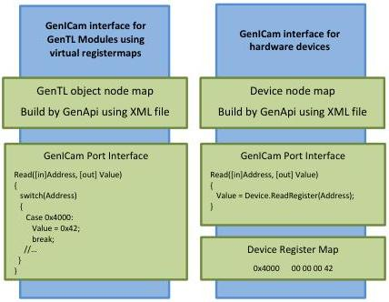

|   CAM |   |  emva  |
| --- | --- | --- |
|  Version 1.6 | GenTL Standard  |   |

Figure 2-3: GenICam GenTL interface (C and GenApi Feature-interface)

The GenTL Producer driver consists of three logical parts: the C interface, the Configuration interface and the Event interface (signaling). The interfaces are detailed in the following paragraphs.

#### 2.3.1 C Interface

The C interface provides the entry point of the GenTL Producer. It enumerates and creates all module instances. It includes the acquisition handled by the Data Stream module. The Signaling and Configuration interfaces of the module are also accessed by GenTL Consumer through the C interface. Thus it is possible to stream an image by just using the C interface, independent of the underlying technology. The default state of a GenTL Producer should ensure the ability to open a device and receive data from it.

A C interface was chosen because of the following reasons:

- Support of multiple client languages: a C interface library can be imported by many programming languages. Basic types can be marshaled easily between the languages and modules (different heaps, implementation details).