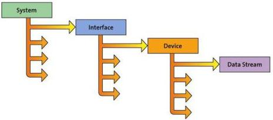

|  GEN<I>CAM |   | emva  |
| --- | --- | --- |
|  Version 1.6 | GenTL Standard  |   |

## 3 Module Enumeration and Instantiation

The behavior described below is seen from a single process' point of view. A GenTL Producer implementation must make sure that every process that is allowed to access the resources has this separated view on the hardware without the need to know that other processes are involved.

For a detailed description of the C functions and data types see chapter 6 Software Interface (page 59ff). For how to configure a certain module or get notified on events see chapter 4 Configuration and Signaling (page 31ff).

Figure 3-4: Enumeration hierarchy of a GenTL Producer

### 3.1 Setup

Before the System module can be opened and any operation can be performed on the GenTL Producer driver the GCInitLib function must be called. This must be done once per process. After the System module has been closed (when, e.g., the GenTL Consumer is closed) the GCCloseLib function must be called to properly free all resources. If the library is used after GCCloseLib was called the GCInitLib must be called again.

There is no reference counting within a single process for GCInitLib. Thus even when GCInitLib is called twice from within a single process space without accompanying call to GCCloseLib, the second call will return the error GC_ERR_RESOURCE_IN_USE. The first call to GCCloseLib from within that process will free all resources. The same is true for multiple calls to GCCloseLib without an accompanying call to GCInitLib.