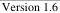

|   CAM |   |  emva  |
| --- | --- | --- |
|  Version 1.6 | GenTL Standard  |   |

The GenTL Consumer must make sure that calls to the IFUpdateDeviceList function and the functions accessing the list are not made concurrent from multiple threads and that all threads are aware of an update operation. The GenTL Producer must make sure that any list access is done in a thread safe way because the access to the lists could be made from multiple threads and the storage for these lists is not thread local. Therefore updating the list from one thread can affect the index used in another thread.

The number of entries in the internally generated device list can be obtained by calling the IFGetNumDevices function. Like the interface list of the System module, this list does not hold the DEV_HANDLEs of the devices but their unique IDs. To retrieve an ID from the list call the IFGetDeviceID function. By not requiring a device to be opened to be enumerated, it is possible to use different devices in different processes. This is of only the case if the GenTL Producer supports the access from different processes.

Before opening a Device module more information about it might be necessary. To retrieve that information call the IFGetDeviceInfo function.

To open a Device module the IFOpenDevice function is used. As with the interface ID the device ID can be used, if known prior to the call, to open a device directly by calling IFOpenDevice. The ID must not change between two sessions. The IFUpdateDeviceList function may be called nevertheless for the creation of the Interface internal list of available devices. IFUpdateDeviceList must be called before any call to IFGetNumDevices or IFGetDeviceID. In case the instantiation of a Device module is possible without having an internal device list the IFOpenDevice may be called without calling IFUpdateDeviceList before. This is necessary if the devices cannot be enumerated in a system, e.g., a network interface with a GigE Vision camera connected through a WAN. A GenTL Producer may call IFUpdateDeviceList at module instantiation if needed. After successful module instantiation the IFUpdateDeviceList may only be called by the GenTL Consumer so that it is aware of any change in that list. A call to IFUpdateDeviceList does not affect any instantiated Device modules and its handles, only the order of the internal list may be affected.

For convenience reasons the GenTL Producer implementation may allow to open a Device module not only with its unique ID but with any other defined name. If the GenTL Consumer then requests the ID on such a module, the GenTL Producer must return its unique ID and not the “name” used to request the module’s handle initially. This allows a GenTL Consumer for example to use the IP address of a remote device in case of a GigE Vision GenTL Producer driver to instantiate the Device module instead of using the unique ID.

After successfully opening the Device using IFOpenDevice, the device module is assumed to be fully operational, based on a real connection to concrete remote device (see also chapter 3.4). There might be situations when the host side of the connection (i.e. the Interface module) needs to be configured to successfully open the device (examples can be correct IP address setting of a network card matching the connected GigE Vision camera or frame grabber bit rate configuration). In such cases the GenTL Producer might provide suitable features to configure the connection parameters in the Interface module nodemap. GenTL Consumer can use them when necessary before calling IFOpenDevice. The set of such