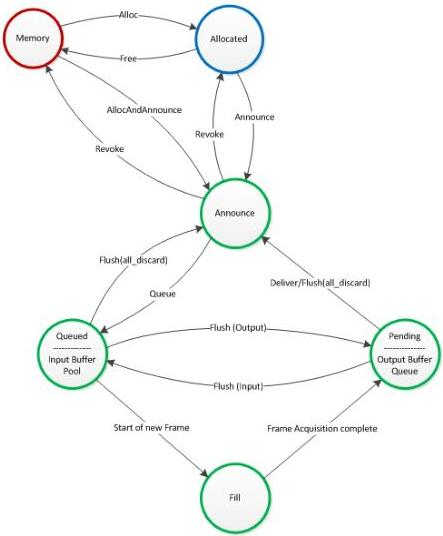

|  CAN |   | emva  |
| --- | --- | --- |
|  Version 1.6 | GenTL Standard  |   |

Figure 5-5: Acquisition chain seen from a buffer's perspective

#### 5.2.1 Allocate Memory

First the size of a single buffer has to be obtained. In order to obtain that information the GenTL Consumer must query the GenTL Data Stream module (important: not the remote device) to check if the payload size information is provided through the GenTL Producer by calling DSGetInfo function with the command STREAM_INFO_DEFINES_PAYLOADSIZE. If the returned information is true the Consumer must call DSGetInfo with STREAM_INFO_PAYLOAD_SIZE to retrieve the current payload size. Additionally the GenTL Producer may provide a “PayloadSize” feature in the node map of the Data Stream Module reflecting the GenTL Producer’s payload size. The value reported through that feature must be the same as provided through DSGetInfo.