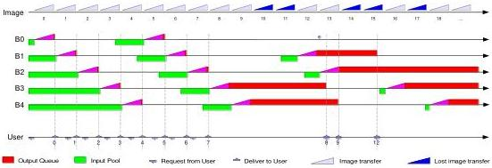

|  CAN |   | emva  |
| --- | --- | --- |
|  Version 1.6 | GenTL Standard  |   |

Figure 5-6: Default acquisition from the GenTL Consumer's perspective

The buffer acquired first (the oldest) is always delivered to the GenTL Consumer. No buffer is discarded or overwritten in the Output Buffer Queue. By successive calls to retrieve the event data (and thus the buffers) all filled buffers are delivered in the order they were acquired. This is done regardless of the time the buffer was filled.

It is not defined which buffer is taken from the Input Buffer Pool if new image data is received. If no buffer is in the Input Buffer Pool (e.g., the requeuing rate falls behind the transfer rate over a sufficient amount of time), an incoming image will be lost. The acquisition engine will be stalled until a buffer is requeued.

#### Wrap-Up:

- There is no defined order in which the buffers are taken from the Input Buffer Pool.
- As soon as it is filled a buffer is placed at the end of the Output Buffer Queue.
- The acquisition engine stalls if the Input Buffer Pool becomes empty and as long as a buffer is queued.

### 5.4 Chunk Data Handling

#### 5.4.1 Overview

The GenICam GenApi standard contains a notion of "chunk data". These are chunks of data present in a single buffer acquired from the device together with or without other payload type data. Each chunk is identified unequivocally by its ChunkID (up to 64Bit unsigned integer) which maps it to the corresponding port node in the remote device's XML description file. The information carried by individual chunks is described in the XML file. To address the data in the chunk the GenApi implementation must know the position (offset) of the chunk in the buffer and its size. The structure of the chunk data in the buffer is technology specific and it is therefore the responsibility of the GenTL Producer to parse the chunk data in the buffer (if there are any). To parse a buffer containing chunk data, the GenTL Consumer uses the function DSGetBufferChunkData which reports the number of chunks in the buffer and for each chunk its ChunkID, offset and size as an array of