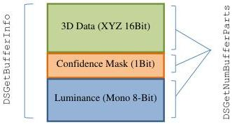

|  CAN |   | emva  |
| --- | --- | --- |
|  Version 1.6 | GenTL Standard  |   |

not modify the pixel format and that the pixel format in the buffer corresponds to the PixelFormat feature value in the nodemap of the remote device.

The only exception among the parameters listed in BUFFER_INFO_CMD and BUFFER_PART_INFO_CMD is the payload size value which needs to be known before any buffers are delivered (as it is used for buffer allocation). Thus, if the GenTL Producer modifies the payload size it has to report the actual value through the STREAM_INFO_PAYLOAD_SIZE command, as described in chapter 5.2.1.

It might be useful to report the modifications also through corresponding features of the stream and buffer nodemaps.

The GenTL Producer must take special care when modifying image data within a stream carrying chunk data. Such modifications must not result in a corrupted chunk data layout. In this case the GenTL Producer must reconstruct the chunk buffer.

### 5.6 Multi-Part Buffer Handling

#### 5.6.1 Overview

There are many versatile use cases where the GenTL Producer needs to deliver different sets of data that belong logically together (in particular data coming from a single "exposure"), but consist of multiple distinct parts.

To allow effective delivery of such data the GenTL introduces a multi-part buffer payload type (PAYLOAD_TYPE_MULTI_PART). The different data segments of a multi-part buffer are placed physically into a single buffer. The number of the parts and the properties of the individual parts can be obtained using the functions DSGetNumBufferParts and DSGetBufferPartInfo.

When receiving multi-part payload data, the GenTL Consumer is expected to query the number of distinct data parts in the buffer and properties of the individual parts using the functions mentioned above. It is important to note that some properties of the data (e.g., the AOI and/or the data format) are described as part-specific information using corresponding info commands supported by the DSGetBufferPartInfo function. When dealing with multi-part data the "buffer-global" info function DSGetBufferInfo can not be used to query buffer-part specific information (e.g., BUFFER_INFO_PIXELFORMAT,