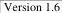

|  CAN |   | emva  |
| --- | --- | --- |
|  Version 1.6 | GenTL Standard  |   |

data type. When using the floating point confidence format, the confidence level is usually reported using the interval  \( [0.0, 1.0] \) . These rules are not necessarily strict and might be redefined in specific use cases.

Use cases for the pixel confidence data include assigning a level of reliability of individual point coordinates in a 3D point cloud or masking of non-rectangular images.

#### 5.6.5 3D Data Exchange

3D devices frequently do not only provide the 3D data itself, but also additional information such as the intensity image, pixel confidence information or even various other additional image properties.

The multi-part payload type is thus usually the best option to transfer data belonging to a single exposure.

Note that to fully interpret the 3D data in a multi-part buffer, it is typically required to query additional information using the well-defined 3D data model in SFNC.

#### 5.6.6 Non-Line Oriented Data

With some data formats (for example in case of a 3D point cloud), the pixels within the payload might not be necessarily line oriented or organized in a rectangular matrix, but rather just an unorganized set of pixels. In such case, it is recommended that the image width (BUFFER_PART_INFO_WIDTH) is always set to 1 and image height (BUFFER_PART_INFO_HEIGHT) is used to describe the number of unorganized pixels in the payload. This is aligned with similar practice in other standards.

#### 5.6.7 Multi-Source Devices

In most "simple" cases the data in all parts originates from the same source (such as physical sensor) and can be pixel-mapped together. This means that pixels of the same row/column coordinates (considering also the AOI offset parameters of each part) are assumed to be expressing different properties of the same pixel in the acquired scene. This way, for example a point with given 3D coordinates coming from individual coordinate planes (PART_DATATYPE_3D_PLANE_TRIPLANAR) can be mapped to the intensity value coming from pixel at the same position in the 2D image data part (PART_DATATYPE_2D_IMAGE).

There are, however, more complex devices providing possibly data from multiple sources in parallel. An example can be a dual-sensor device. In such case the pixels from parts carrying data from the different sources cannot be directly mapped together.

The producer reports the information which parts come from the same source (and thus can be pixel-mapped together) using the BUFFER_PART_INFO_SOURCE_ID info command. Data coming from same (pixel-mappable) source should be marked using the same source ID, data from different sources should be marked using different source ID's.