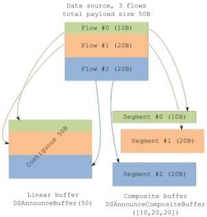

|   CAM |   |  emva  |
| --- | --- | --- |
|  Version 1.6 | GenTL Standard  |   |

When one or more announced composite buffers are not sufficient for acquisition given the current flow configuration, the GC ERR BUFFER TOO SMALL error code is used in the same way as defined for non-composite buffers in 5.2.1. It is used the very same way either when starting the acquisition or when discovering the problem at runtime, including use of the BUFFER INFO IS INCOMPLETE and

BUFFER INFO DATA LARGER THAN BUFFER flags.

The configuration of the acquisition data mapping into flows is in general beyond scope of the GenTL specification. The principal use case for flows is, however, GenDC streaming. In case of use with GenDC, the flow mapping rules will adhere to the GenDC specification and related sections in SFNC or GenTL SFNC documents.

#### 5.7.3 GenDC Streaming

GenTL supports data acquisition in the GenDC format (PAYLOAD TYPE GENDC). In this case, the structure and contents of the data is defined by the GenDC specification and should be interpreted according its rules.

To guarantee flawless GenDC data exchange, independent of transport layer specific details, the GenTL Producer and GenTL Consumer must stick to a few basic rules described below.

The buffer delivered with GenDC payload (PAYLOAD TYPE GENDC) must contain exactly one GenDC container descriptor (as defined by GenDC) and it must be the “final” descriptor type. If given transport layer technology does not deliver the descriptor within the data payload (but e.g. within data leader section used by some technologies), the GenTL Producer has to guarantee that the container descriptor is copied into the destination buffer. This implies that the GenTL Producer also provides correct PayloadSize information including space for the descriptor. Note that these requirements are important to hide transport layer