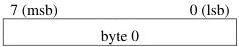
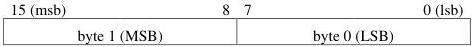
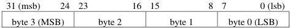

|  GENICAM |   | emva  |
| --- | --- | --- |
|  Version 2.4 | Pixel Format Naming Convention  |   |

### 1.3 Reference Documents

|  IEC 60559:1989 | Binary floating-point arithmetic for microprocessor systems, second edition (IEC 60559:1989), also known as IEEE Standard for Binary Floating-Point Arithmetic (ANSI/IEEE 754-1985)  |
| --- | --- |
|  GenICam | Generic Interface for Camera, version 3.0  |
|  GenICam SFNC | GenICam Standard Features Naming Convention, version 2.2  |
|  ITU-R BT.601-7 | Studio encoding parameters of digital television for standard 4:3 and wide screen 16:9 aspect ratios  |
|  ITU-R BT.709-5 | Parameter values for the HDTV standards for production and international programme exchange  |
|  JFIF | JPEG File Interchange Format, version 1.02  |

### 1.4 Assumptions

- Pixels have a maximum of 4 components (ex: alpha-red-green-blue). In this text, we use the generic LMNO designation to represent those components (ex: LMN could represent RGB where R = L, G = M and B = N).
- Some components might be sub-sampled (ex: Y’CbCr 4:2:2 and 4:1:1).
- The following figure illustrates 8-bit, 16-bit and 32-bit data words respectively. The way this data is stored in memory (little-endian or big-endian) is not defined by this convention, though the illustrations use little-endian.

Figure 1-1 : 8-bit pixel data

Figure 1-2 : 16-bit pixel data

Figure 1-3 : 32-bit pixel data