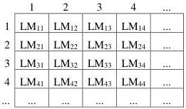
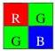
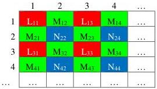

|  GEN<i>CAM |   |  emva  |
| --- | --- | --- |
|  Version 2.4 | Pixel Format Naming Convention  |   |

#### 3.1.6 LM44 Location

This format is typically used for any 2-component pixels, such as Coord3D_AC, used by line scan 3D devices (where B coordinate is implicit or e.g. defined by an encoder position). No sub-sampling is performed.

Ex: Coord3D_AC16

Figure 3-6 : LM44 Pixel Location

#### 3.1.7 Bayer Location

For Bayer patterns in this section, red = L, green = M and blue = N.

##### Bayer_LMMN Location

This is the format where the green component occupies the  \( 2^{nd} \)  and  \( 3^{rd} \)  cell within the tile. The red component occupies the first cell while the blue component fills the  \( 4^{th} \)  cell.

Ex: BayerRG8

Figure 3-7: BayerRG array

Figure 3-8: Bayer_LMMN Pixel Location