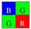
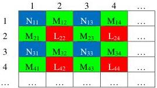
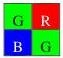

|  GEN<i>CAM |   |   |
| --- | --- | --- |
|  Version 2.4 | Pixel Format Naming Convention  |   |

#### Bayer_NMML Location

This is the format where the green component occupies the  \( 2^{nd} \)  and  \( 3^{rd} \)  cell within the tile. The blue component occupies the first cell while the red component fills the  \( 4^{th} \)  cell.

Ex: BayerBG8

Figure 3-9: BayerBG array

Figure 3-10: Bayer_NMML Pixel Location

#### Bayer_MLNM Location

This is the format where the green component occupies the  \( 1^{st} \)  and  \( 4^{th} \)  location within the tile. The red component occupies the  \( 2^{nd} \)  cell while the blue component fills the  \( 3^{rd} \)  cell.

Ex: BayerGR8

Figure 3-11: BayerGR array