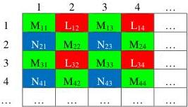
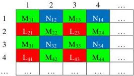

Figure 3-12: Bayer_MLNM Pixel Location

# Bayer_MNLM Location

This is the format where the green component occupies the 1st and 4th location within the tile. The blue component occupies the 2nd cell while the red component fills the 3rd cell.

Ex: BayerGB8

Figure 3-13: BayerGB array

Figure 3-14: Bayer_MNLM Pixel Location

### 3.1.8 BiColor_LMNO Location

Bi-color is a color filter array (CFA) that refers to an image composed of two-color component pixels. The sensor can contain up to four color components (L, M, N and O), but each pixel only has information on two of those components (either L and M, or N and O). The missing color components of a pixel can be interpolated from adjacent pixels in a fashion similar to a CFA.