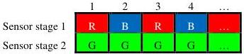
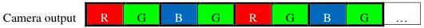
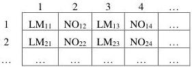

|  GEN<i>CAM |   |   |
| --- | --- | --- |
|  Version 2.4 | Pixel Format Naming Convention  |   |

For instance, a two-stage line scan sensor could expose the objects twice with different portions of the sensor, so both portions represent the same physical object location. The color filter array of the sensor could have the red and blue color components on the first line, and the green component on the second line.

Figure 3-15: Bi-color sensor with 2 stages

The camera combines those 2 stages and output the following data:

Figure 3-16: Bi-color camera output from 2 stages

The above is on example. Other grouping of 2 components into a given pixel location are possible.

The location of the bi-color pixels is represented by the following diagram where 2 components are combined at each location.

Figure 3-17: BiColor_LMNO Pixel Location

#### 3.1.9 Sparse Color Filter Location

Spare Color Filter is a color filter array that includes panchromatic pixels with the red, green and blue color components. Different tile patterns can be created.

For Sparse Color Filter patterns in this section, white = L, blue = M, green = N and red = O.

##### SCF1_LMLN Location

SCF1_LMLN is a sparse color filter pixel layout where:

1. The panchromatic (white) component occupies the \(1^{\mathrm{st}}\), \(3^{\mathrm{rd}}\), \(6^{\mathrm{th}}\), \(8^{\mathrm{th}}\), \(9^{\mathrm{th}}\), \(11^{\mathrm{th}}\), \(14^{\mathrm{th}}\) and \(16^{\mathrm{th}}\) location in a 4x4 tile;
2. The green component occupies the  \( 4^{th} \) ,  \( 7^{th} \) ,  \( 10^{th} \)  and  \( 13^{th} \)  cell.
3. The blue component occupies the  \( 2^{nd} \)  and  \( 5^{th} \)  cell.