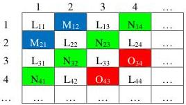
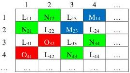

|  GEN<i>CAM |   |   |
| --- | --- | --- |
|  Version 2.4 | Pixel Format Naming Convention  |   |

4. The red component occupies the  \( 12^{th} \)  and  \( 15^{th} \)  cell.

The first line of the tile is thus WBWG.

Ex: SCF1WBWG8

Figure 3-18: SCF1_LMLN Pixel Location

#### SCF1_LNLM Location

SCF1_LNLM is a sparse color filter pixel layout where:

1. The panchromatic (white) component occupies the \(1^{\mathrm{st}}\), \(3^{\mathrm{rd}}\), \(6^{\mathrm{th}}\), \(8^{\mathrm{th}}\), \(9^{\mathrm{th}}\), \(11^{\mathrm{th}}\), \(14^{\mathrm{th}}\) and \(16^{\mathrm{th}}\) location in a 4x4 tile;
2. The green component occupies the  \( 2^{nd} \) ,  \( 5^{th} \) ,  \( 12^{th} \)  and  \( 15^{th} \)  cell.
3. The blue component occupies the  \( 4^{th} \)  and  \( 7^{th} \)  cell.
4. The red component occupies the  \( 10^{th} \)  and  \( 13^{th} \) .

The first line of the tile is thus WGWB.

Ex: SCF1WGWB8

Figure 3-19: SCF1_LNLM Pixel Location

#### SCF1_LOLN Location

SCF1_LOLN is a sparse color filter pixel layout where:

1. The panchromatic (white) component occupies the \(1^{\mathrm{st}}\), \(3^{\mathrm{rd}}\), \(6^{\mathrm{th}}\), \(8^{\mathrm{th}}\), \(9^{\mathrm{th}}\), \(11^{\mathrm{th}}\), \(14^{\mathrm{th}}\) and \(16^{\mathrm{th}}\) location in a 4x4 tile;
2. The green component occupies the  \( 4^{th} \) ,  \( 7^{th} \) ,  \( 10^{th} \)  and  \( 13^{th} \)  cell.