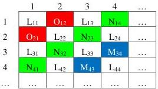
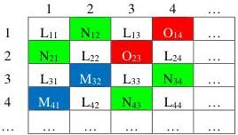

|  GEN<i>CAM |   |   |
| --- | --- | --- |
|  Version 2.4 | Pixel Format Naming Convention  |   |

3. The blue component occupies the \(12^{\text{th}}\) and \(15^{\text{th}}\) cell.
4. The red component occupies the  \( 2^{nd} \)  and  \( 5^{th} \)  cell.

The first line of the tile is thus WRWG.

Ex: SCF1WRWG8

Figure 3-20: SCF1_LOLN Pixel Location

#### SCF1_LNLO Location

SCF1_LNLO is a sparse color filter pixel layout where:

5. The panchromatic (white) component occupies the \(1^{\mathrm{st}}\), \(3^{\mathrm{rd}}\), \(6^{\mathrm{th}}\), \(8^{\mathrm{th}}\), \(9^{\mathrm{th}}\), \(11^{\mathrm{th}}\), \(14^{\mathrm{th}}\) and \(16^{\mathrm{th}}\) location in a 4x4 tile;
6. The green component occupies the \(4^{\text{th}}\), \(7^{\text{th}}\), \(10^{\text{th}}\) and \(13^{\text{th}}\) cell.
7. The blue component occupies the  \( 10^{th} \)  and  \( 13^{th} \) .
8. The red component occupies the  \( 4^{th} \)  and  \( 7^{th} \)  cell.

The first line of the tile is thus WRWG.

Ex: SCF1WGWR8

Figure 3-21: SCF1_LNLO Pixel Location

#### 3.1.10 CFA_xxxx Location (square pattern)

CFA stands for generic “Color Filter Array”. It is used for CFAs other than the popular Bayer tile and Sparse Color Filter defined earlier. ‘xxxx’ explicitly represents the sequence of color components in the square pattern expressed in raster-scan. For example, “CFA_RBGG” would be a CFA pattern with red-blue