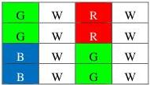
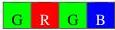

|  GEN<i>CAM |   |   |
| --- | --- | --- |
|  Version 2.4 | Pixel Format Naming Convention  |   |

on first line and green-only on the second line. It can be used to express CFA larger than 2x2 as illustrated below. For instance “CFA_GWRWGWRWBWGWBWGW” is the sequence represented by the pattern below.

Figure 3-22 : Examples of a generic 4x4 CFA

Note: When a specific CFA pattern becomes widespread, it is possible to assign it a shorter name to reference it. This could be a display name that is more human-readable. To enable interoperability, this short name has to be included in this naming convention. Bayer and Sparse Color Filter are 2 examples used by this convention.

#### 3.1.11 CFA<#lines>by<#columns>_xxxx Location (non-square pattern)

Some Color Filter Arrays (CFA) have a non-square pattern. For these cases, the dimensions of the pattern must be explicitly specified. This is achieved by directly indicating the number of lines followed by the number of columns used by the pattern right after the CFA prefix. The rest of the pixel name follows the same principle of the CFA_xxxx presented above: 'xxxx' explicitly represents the sequence of color components in the pattern presented in raster-scan (left to right, then top to bottom). This type of pattern can be used in linescan applications.

Figure 3-23: CFA1by4_GRGB array