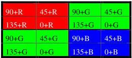

|  GEN<i>CAM |   | emva  |
| --- | --- | --- |
|  Version 2.4 | Pixel Format Naming Convention  |   |

#### POL44C1 Location

POL44C1 defines a 4 by 4 filter array with following color filter applied.

Figure 3-25: POL44C1 array

Example of a complete code with 12 bits per pixel:

POL44C1_12: As defined in above figure.

POL44C1X_12: Reversed by x

### 3.2 Components

The components provide the primary information of the pixel. Basic component designation might be extended by an indicator providing additional information about pixel positioning in the image (pixel sequence for Bayer, sub-sampling for Y'CbCr, ...). When needed, an additional identifier might be inserted to differentiate between 2 very similar formats (such as ITU-R BT.601 and ITU-R BT.709 color space for Y'CbCr).

Table 3-1 : Component Designation

|  Component designation | Positioning in Image | Description  |
| --- | --- | --- |
|  “Raw” | Mono location | Raw sensor data with no reference to any color space  |
|  “Mono” | Mono location | Monochrome (luma only)  |
|  “R” | Mono location | Red only  |
|  “G” | Mono location | Green only  |
|  “B” | Mono location | Blue only  |
|  “RGB” | LMN444 location | Red-Green-Blue  |
|  “BGR” | LMN444 location | Blue-Green-Red  |
|  “BayerGR” | Bayer_MLNM location | Bayer filter Green-Red-Blue-Green  |