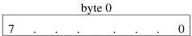
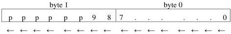

|  GEN<i>CAM |   | emva  |
| --- | --- | --- |
|  Version 2.4 | Pixel Format Naming Convention  |   |

## 6 Optional Packing Style

This convention defines optional packing styles and includes an additional tag to align pixel to a certain bit boundary. In most cases, the style needs to support both lsb and msb aligned components. PFNC defines lsb bit ordering as the default for pixel formats received in image buffers.

Important: For image buffers, PFNC defines lsb as the default ordering. Therefore, unless msb is explicitly specified in the pixel name, all pixel formats must use lsb ordering when they are put in a PFNC-compliant image buffer. In this case, the lsb suffix does not need to be spelled out explicitly.

### 6.1 Unpacked

Unpacked is one of the most prevalent styles where each component occupies an integer number of bytes: padding bits are put as necessary in the least or most significant bits to reach the next 8-bit boundary.

#### 6.1.1 lsb Unpacked

By default, unpacked style uses “lsb unpacked” and does not need to be explicitly specified. When no padding bit is necessary, then “lsb unpacked” designation takes precedence over “msb unpacked”. lsb unpacked is thus the default for 8-bit and 16-bit components.

For lsb unpacked, each component is aligned to the lsb and its msb's are zero-padded to nearest byte (8-bit) boundary. Hence next component (or pixel) always starts on the next byte. It is the typical pixel format used for image buffers on the PC-side to facilitate image processing.

Note: In the following figures, the 'p' stands for padding bit. This means that position is a padding zero.

Note that in the following figures, we put byte 0 on the right to help illustrate the concept.

Figure 6-1: Mono8 unpacked

Figure 6-2: Mono10 unpacked