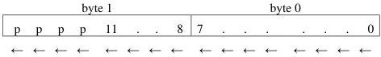
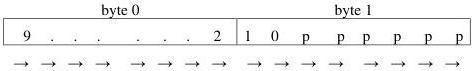
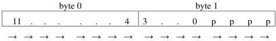

|   |   |   |
| --- | --- | --- |
|  Version 2.4 | Pixel Format Naming Convention  |   |

Figure 6-3: Mono12 unpacked

#### Pixel construction rules for the “lsb Unpacked” style

To construct the pixel stream:

1) Put the component in the least significant bits.
2) Pad the most significant bits to the nearest 8-bit boundary if needed.
3) Start with the next component on the next 8-bit boundary.

#### 6.1.2 msb Unpacked

For msb unpacked, each component is filled msb first and its lsb's are zero-padded to the nearest byte (8-bit) boundary. Hence next component (or pixel) always starts on the next byte. For PFNC-compliant image buffers, msb unpacked must be explicitly specified in the pixel format name by appending "msb".

Note: If the component size is a multiple of 8 bits, then use lsb unpacked since no padding bits is necessary and this convention aims for the shortest string to represent the pixel name.

Note that in the following figures, we put byte 0 on the left to help illustrate the concept.

Figure 6-4: Mono10msb unpacked

Figure 6-5: Mono12msb unpacked