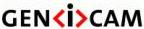
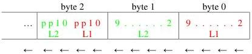
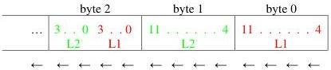
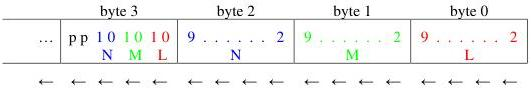
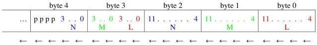

|   |   |   |
| --- | --- | --- |
|  Version 2.4 | Pixel Format Naming Convention  |   |

#### 6.4.1 lsb Grouped

lsb grouped is the default grouping mode and does not need to be explicitly specified after the 'g' indicator.

For lsb grouped, the msb's of the components are extracted and put in sequence starting with the first component in byte 0. The lsb's of the components are grouped together in a separate byte that is put last. This last byte is filled by grouping components starting from the lsb using the component order.

Note that in the following figures, we put byte 0 on the right to help illustrate the concept.

Figure 6-12: 2 monochrome 10-bit pixels with lsb grouped into 12 bits (Mono10g12)

Figure 6-13: 2 monochrome 12-bit pixels with lsb grouped into 24 bits (Mono12g)

Figure 6-14: 3 components of 10-bit with lsb grouped into 32-bit pixel (RGB10g32)

Figure 6-15 : 3 components of 12-bit with lsb grouped into 40-bit pixel (RGB12g40)