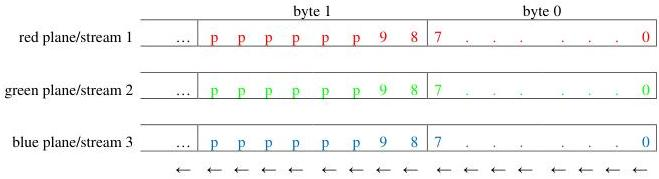

|  GEN<i>CAM |   | emva  |
| --- | --- | --- |
|  Version 2.4 | Pixel Format Naming Convention  |   |

## 7 Interface-specific

The various camera interfaces in the machine vision industry might need to provide additional information about how the data is put onto the interface. This might include the sequence of components in the data packets or the usage of multiple streams to transfer the various components (ex: planar mode).

Any interface-specific field must be delimited by an underscore ‘_’ from the rest of the pixel text.

Although this convention does not try to cover all possibilities, it does list the following typical use cases.

### 7.1 Planar mode

When each component is transmitted over a different stream/plane or as a separate single-component/monochromatic image, then the pixel format should use the “Planar” suffix.

Ex: RGB10_Planar transmitted as 3 different streams: red plane, green plane and blue plane

Figure 7-1: RGB10_Planar

The camera interface standard must indicate how those streams are transmitted.

### 7.2 Semiplanar mode

When two or more components are combined in one stream/plane, then the pixel format should use the “Semiplanar” suffix. Hence within this pixel format we have 1 or more planes with multiple components.

Ex: YCbCr420 Semi-Planar mode as 2 different streams: one Y plane and one CbCr plane with interleaved and sub-sampled blue and red data.

|  Plane/stream1 | Y0 | Y1 | Y2 | Y3 | Y4 | Y5 | Y6 | Y7 | ...  |
| --- | --- | --- | --- | --- | --- | --- | --- | --- | --- |
|  Plane/stream2 | Cb0 | Cr0 | Cb2 | Cr2 | Cb4 | Cr4 | Cb6 | Cr6 | ...  |

To symbolize the plane/component sequence in a Semiplanar pixel format name, an underscore (‘_’) is used to separate the planes.