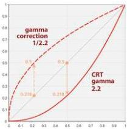

|  GEN<i>CAM |   | emva  |
| --- | --- | --- |
|  Version 2.4 | Pixel Format Naming Convention  |   |

## 8 Appendix A - Color Space Transforms

This section describes the equations a camera should use to convert from gamma-corrected R'G'B' color space into a new color space. The "prime" symbol denotes a gamma corrected value. Most equations assume 8-bit color components (ranging from 0 to 255) and can be easily adjusted for different bit depths.

### 8.1 Gamma Correction

Gamma correction is used to compensate for non-linearity of the display apparatus. This is a non-linear operation that might impact digital image processing. For instance, a threshold is no longer linear. But it can be useful to amplify low-intensity details at the expense of brighter image details.

\[
\mathrm{R} ^ {\prime} = \mathrm{R} ^ {1 / \gamma}
\]

\[
\mathrm{G} ^ {\prime} = \mathrm{G} ^ {1 / \gamma}
\]

\[
\mathrm{B} ^ {\prime} = \mathrm{B} ^ {1 / \gamma}
\]

where  \( \gamma \)  is the gamma value used for the correction

Equation 1: Gamma Correction

Figure 8-1: Gamma Correction for ITU-R BT.601 (image from Wikipedia)

The prime symbol (') is used to indicate a gamma-corrected component. In the literature, the prime symbol is frequently omitted creating some confusion.