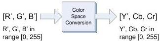

|  GEN<i>CAM |   |   |
| --- | --- | --- |
|  Version 2.4 | Pixel Format Naming Convention  |   |

Figure 8-2 : Generic full scale Y'CbCr

From the coefficients in (1), one can determine the possible range of values for the 2 color difference signals shown in (3):

\[
\mathrm{E} ^ {\prime} \mathrm{B} - \mathrm{E} ^ {\prime} \mathrm{Y} \quad \text { is   in   the   range } [ - 0. 8 8 6, + 0. 8 8 6 ] \tag {5}
\]

\[
\mathrm{E} ^ {\prime} \mathrm{R} - \mathrm{E} ^ {\prime} \mathrm{Y} \quad \text { is   in   the   range } [ - 0. 7 0 1, + 0. 7 0 1 ]
\]

The next step is to normalize the 2 color difference so they occupy the full scale of  \( [-0.5, +0.5] \) .

\[
\mathrm{E} ^ {\prime} \mathrm{Cb} = (0. 5 / 0. 8 8 6) (\mathrm{E} ^ {\prime} \mathrm{B} - \mathrm{E} ^ {\prime} \mathrm{Y}) \tag {6}
\]

\[
\mathrm{E} ^ {\prime} \mathrm{Cr} = (0. 5 / 0. 7 0 1) (\mathrm{E} ^ {\prime} \mathrm{R} - \mathrm{E} ^ {\prime} \mathrm{Y})
\]

where  \( E'_{Cb} \)  and  \( E'_{Cr} \)  are in the range [-0.5, +0.5].

In 8 bits, Y', Cb and Cr are derived by normalizing E'Y, E'Cb and E'Cr to [0, 255]. Note that Cb and Cr are signed shifted by 128 since E'Cb and E'Cr are in the range [-0.5, 0.5]. Including (6) leads to:

\[
\mathrm{Y} ^ {\prime} = 2 5 5 \mathrm{E} _ {\mathrm{Y}} ^ {\prime} \tag {7}
\]

\[
\mathrm{Cb} = 2 5 5 \mathrm{E} _ {\mathrm{Cb}} ^ {\prime} + 1 2 8 = 2 5 5 \times (0. 5 / 0. 8 8 6) (\mathrm{E} _ {\mathrm{B}} ^ {\prime} - \mathrm{E} _ {\mathrm{Y}} ^ {\prime}) + 1 2 8
\]

\[
\mathrm{Cr} = 2 5 5 \mathrm{E} _ {\mathrm{Cr}} ^ {\prime} + 1 2 8 = 2 5 5 \times (0. 5 / 0. 7 0 1) (\mathrm{E} _ {\mathrm{R}} ^ {\prime} - \mathrm{E} _ {\mathrm{Y}} ^ {\prime}) + 1 2 8
\]

Full scale R', G' and B' in 8 bits offers the following equations:

\[
\mathrm{R} ^ {\prime} = 2 5 5 \mathrm{E} _ {\mathrm{R}} ^ {\prime} \tag {8}
\]

\[
\mathrm{G} ^ {\prime} = 2 5 5 \mathrm{E} _ {\mathrm{G}} ^ {\prime}
\]

\[
\mathrm{B} ^ {\prime} = 2 5 5 \mathrm{E} _ {\mathrm{B}} ^ {\prime}
\]