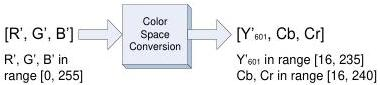

|  GEN<i>CAM |   | emva  |
| --- | --- | --- |
|  Version 2.4 | Pixel Format Naming Convention  |   |

Considering (9), we need to normalize (6) into 8-bit components that do not occupy the full 256 values:

\[
\mathrm{Y} _ {6 0 1} ^ {\prime} = 2 1 9 \mathrm{E} _ {\mathrm{Y}} ^ {\prime} + 1 6 \tag {10}
\]

\[
\mathrm{Cb} = 2 2 4 \mathrm{E} _ {\mathrm{Cb}} ^ {\prime} + 1 2 8 = 2 2 4 \times (0. 5 / 0. 8 8 6) (\mathrm{E} _ {\mathrm{B}} ^ {\prime} - \mathrm{E} _ {\mathrm{Y}} ^ {\prime}) + 1 2 8
\]

\[
\mathrm{Cr} = 2 2 4 \mathrm{E} _ {\mathrm{Cr}} ^ {\prime} + 1 2 8 = 2 2 4 \times (0. 5 / 0. 7 0 1) (\mathrm{E} _ {\mathrm{R}} ^ {\prime} - \mathrm{E} _ {\mathrm{Y}} ^ {\prime}) + 1 2 8
\]

At this point, two options exist depending on the allowed range for RGB components. This does not create a different pixel format for Y'CbCr601, but mainly determines two set of equations depending on the input range of values used for the RGB component.

#### Full scale RGB

Full scale RGB uses (8) to define the relationship between the R', G' and B' components and E'R, E'G and E'B.

Figure 8-3 : Full scale RGB for BT.601

Replacing (8) into (10) leads to:

\[
\begin{array}{l} \mathrm{Y} _ {6 0 1} ^ {\prime} = 0. 2 5 6 7 9 \mathrm{R} ^ {\prime} + 0. 5 0 4 1 3 \mathrm{G} ^ {\prime} + 0. 0 9 7 9 1 \mathrm{B} ^ {\prime} + 1 6 \\ \mathrm{Cb} = - 0. 1 4 8 2 2 \mathrm{R} ^ {\prime} - 0. 2 9 0 9 9 \mathrm{G} ^ {\prime} + 0. 4 3 9 2 2 \mathrm{B} ^ {\prime} + 1 2 8 \\ \mathrm{Cr} = 0. 4 3 9 2 2 \mathrm{R} ^ {\prime} - 0. 3 6 7 7 9 \mathrm{G} ^ {\prime} - 0. 0 7 1 4 3 \mathrm{B} ^ {\prime} + 1 2 8 \\ \text { with   } R ^ {\prime}, G ^ {\prime} \text {   and   } B ^ {\prime} \text {   in   the   range   [0,255]. } \\ \end{array}
\]

Equation 4 : Full scale R'G'B' to Y'CbCr601 conversion (8 bits)

For 8-bit data, the valid range of values for each component is:

❖ R', G' and B' in range [0, 255], unsigned (256 levels)
❖ Y'601 in the range [16, 235], unsigned (220 levels)
❖ Cb and Cr in range [16, 240], signed shifted by 128, with 128 representing 0 (225 levels)

Values must be truncated to fit in that range.