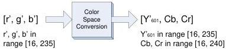

The reverse equations are given by:

\[
\mathrm{R} ^ {\prime} = 1. 1 6 4 3 8 \left(\mathrm{Y} _ {6 0 1} ^ {\prime} - 1 6\right) + 1. 5 9 6 0 3 (\mathrm{Cr} - 1 2 8)
\]

\[
\mathrm{G} ^ {\prime} = 1. 1 6 4 3 8 \left(\mathrm{Y} _ {6 0 1} ^ {\prime} - 1 6\right) - 0. 3 9 1 7 6 (\mathrm{Cb} - 1 2 8) - 0. 8 1 2 9 7 (\mathrm{Cr} - 1 2 8)
\]

\[
\mathrm{B} ^ {\prime} = 1. 1 6 4 3 8 \left(\mathrm{Y} _ {6 0 1} ^ {\prime} - 1 6\right) + 2. 0 1 7 2 3 (\mathrm{Cb} - 1 2 8)
\]

with Y'601 in the range [16, 235] and, Cb and Cr in the range [16, 240].

Equation 5 : Full scale Y'CbCr601 to R'G'B' conversion (8 bits)

#### Scaled down rgb

BT.601 indicates that the RGB components can use a reduced range of values of [16, 235].

Note: The Pixel Format Naming Convention does not define any RGB pixel format using that range of values. But the color conversion equations are provided for completeness since they are referenced by BT.601.

Figure 8-4 : Scaled down rgb for BT.601

This leads to the following equations:

\[
\mathrm{r} ^ {\prime} = 2 1 9 \mathrm{E} _ {\mathrm{R}} ^ {\prime} + 1 6 \tag {11}
\]

\[
\mathrm{g} ^ {\prime} = 2 1 9 \mathrm{E} _ {\mathrm{G}} ^ {\prime} + 1 6
\]

\[
\mathrm{b} ^ {\prime} = 2 1 9 \mathrm{E} _ {\mathrm{B}} ^ {\prime} + 1 6
\]

where \( r' \), \( g' \) and \( b' \) are in the range [16, 235]

Replacing (11) in (10) leads to:

\[
\begin{array}{l} \mathrm{Y} _ {6 0 1} ^ {\prime} = 0. 2 9 9 \mathrm{r} ^ {\prime} + 0. 5 8 7 \mathrm{g} ^ {\prime} + 0. 1 1 4 \mathrm{b} ^ {\prime} \\ \mathrm{Cb} = - 0. 1 7 2 5 9 \mathrm{r} ^ {\prime} - 0. 3 3 8 8 3 \mathrm{g} ^ {\prime} + 0. 5 1 1 4 2 \mathrm{b} ^ {\prime} + 1 2 8 \\ \mathrm{Cr} = 0. 5 1 1 4 2 \mathrm{r} ^ {\prime} - 0. 4 2 8 2 5 \mathrm{g} ^ {\prime} - 0. 0 8 3 1 7 \mathrm{b} ^ {\prime} + 1 2 8 \\ \end{array}
\]

with r', g' and b' in the range [16, 235].

Equation 6 : Scaled down r'g'b' to Y'CbCr601 conversion (8 bits)