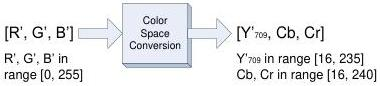

|  GEN<i>CAM |   | emva  |
| --- | --- | --- |
|  Version 2.4 | Pixel Format Naming Convention  |   |

### Full scale RGB

Full scale RGB uses (8) to define the relationship between the R', G' and B' components and E'R, E'G and E'B.

Figure 8-5 : Full scale RGB for BT.709

Replacing (8) into (14) leads to:

\(\mathrm{Y}^{\prime}_{709} = 0.18259\mathrm{R}^{\prime}\) \(+0.61423\mathrm{G}^{\prime} + 0.06201\mathrm{B}^{\prime} + 16\) \(\mathrm{Cb} = -0.10064\mathrm{R}^{\prime}\) \(-0.33857\mathrm{G}^{\prime} + 0.43922\mathrm{B}^{\prime} + 128\) \(\mathrm{Cr} = 0.43922\mathrm{R}^{\prime}\) \(-0.39894\mathrm{G}^{\prime}\) \(-0.04027\mathrm{B}^{\prime} + 128\) with \(\mathrm{R}^{\prime},\mathrm{G}^{\prime}\) and \(\mathrm{B}^{\prime}\) in the range [0, 255].

Equation 8 : Full scale R'G'B' to Y'CbCr709 conversion (8 bits)

For 8-bit data, the valid range of values for each component is:

❖ R', G' and B' in range [0, 255], unsigned (256 levels)
❖ Y'709 in the range [16, 235], unsigned (220 levels)
❖ Cb and Cr in range [16, 240], signed shifted by 128, with 128 representing 0 (225 levels)

Values must be truncated to fit in that range.

The reverse equations are given by:

\(\begin{array}{r l r l} \mathrm{R}^{\prime} = & 1.16438 (\mathrm{Y}^{\prime}_{709} - 16) & + 1.79274 (\mathrm{Cr} - 128) \\ \mathrm{G}^{\prime} = & 1.16438 (\mathrm{Y}^{\prime}_{709} - 16) & -0.21325 (\mathrm{Cb} - 128) & -0.53291 (\mathrm{Cr} - 128) \\ \mathrm{B}^{\prime} = & 1.16438 (\mathrm{Y}^{\prime}_{709} - 16) & + 2.11240 (\mathrm{Cb} - 128) \\ \end{array}\) with \(\mathrm{Y}^{\prime}_{709}\) in the range [16, 235] and, \(\mathrm{Cb}\) and \(\mathrm{Cr}\) in the range [16, 240].

Equation 9 : Full scale Y'CbCr601 to R'G'B' conversion (8 bits)