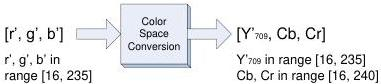

|  GEN<i>CAM |   | emva  |
| --- | --- | --- |
|  Version 2.4 | Pixel Format Naming Convention  |   |

#### Scaled down rgb

BT.709 indicates that the RGB components can use a reduced range of values of [16, 235]. This corresponds to the equations (11).

Note: The Pixel Format Naming Convention does not define any RGB pixel format using that range of values. But the color conversion equations are provided for completeness since they are referenced by BT.709.

Figure 8-6 : Scaled down rgb for BT.709

Replacing (11) in (14) leads to:

\[
\begin{array}{l} \mathrm{Y} _ {7 0 9} ^ {\prime} = 0. 2 1 2 6 \mathrm{r} ^ {\prime} + 0. 7 1 5 2 \mathrm{g} ^ {\prime} + 0. 0 7 2 2 \mathrm{b} ^ {\prime} \\ \mathrm{Cb} = - 0. 1 1 7 1 9 \mathrm{r} ^ {\prime} - 0. 3 9 4 2 3 \mathrm{g} ^ {\prime} + 0. 5 1 1 4 2 \mathrm{b} ^ {\prime} + 1 2 8 \\ \mathrm{Cr} = 0. 5 1 1 4 2 \mathrm{r} ^ {\prime} - 0. 4 6 4 5 2 \mathrm{g} ^ {\prime} - 0. 0 4 6 8 9 \mathrm{b} ^ {\prime} + 1 2 8 \\ \text { with } r ^ {\prime}, g ^ {\prime} \text { and } b ^ {\prime} \text { in   the   range } [ 1 6, 2 3 5 ]. \\ \end{array}
\]

Equation 10 : Scaled down r'g'b' to Y'CbCr709 conversion (8 bits)

For 8-bit data, the range of values for each component is:

❖ Y'709, r', g' and b' in range [16, 235], unsigned (220 levels)
❖ Cb and Cr in range [16, 240], signed shifted by 128, with 128 representing 0 (225 levels)

Values must be truncated to fit in that range.

The reverse equations are given by:

\[
\begin{array}{l} \mathrm{r} ^ {\prime} = \quad \mathrm{Y} _ {7 0 9} ^ {\prime} + 1. 5 3 9 6 5 (\mathrm{Cr} - 1 2 8) \\ \mathrm{g} ^ {\prime} = \quad \mathrm{Y} _ {7 0 9} ^ {\prime} - 0. 1 8 3 1 4 (\mathrm{Cb} - 1 2 8) - 0. 4 5 7 6 8 (\mathrm{Cr} - 1 2 8) \\ \mathrm{b} ^ {\prime} = \quad \mathrm{Y} _ {7 0 9} ^ {\prime} + 1. 8 1 4 1 8 (\mathrm{Cb} - 1 2 8) \\ \end{array}
\]

with Y'709 in the range [16, 235] and, Cb and Cr in the range [16, 240].

Equation 11 : Y'CbCr709 to R'G'B' conversion (8 bits)