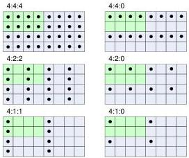

|  GEN<i>CAM |   | emva  |
| --- | --- | --- |
|  Version 2.4 | Pixel Format Naming Convention  |   |

## 9 Appendix B - Sub-sampling notation

The standard sub-sampling notation uses J:a:b convention, where J represents the number of horizontal pixels on a given reference block (the block is always 2 pixels high). Typically, J = 4 and the reference block is 4 pixel wide by 2 lines (illustrated in green in the figure below). The indicator “a” provides the number of chroma samples on the first line while indicator “b” is the number of chroma samples on the second line of the reference block. Luma is not sub-sampled. Both the red and blue chroma are in the same ratio compared to luma.

The position of the chroma samples in relation to the luma can be in two forms:

1. Co-sited
2. Centered

Current version of this convention assumes co-sited positioning, unless noted differently.

Note: This convention could be used for other color components than chroma although common usage is currently limited to YUV and YCbCr.

### 9.1 Co-sited Positioning

With co-sited positioning, the chroma samples are aligned with the first luma sample of the reference block. Figure 9-1 uses co-sited alignment where the first chroma sample (represented by a black dot) is centered in the upper-left pixel of the image. This is the default chroma sample alignment used by this pixel format naming convention.

Figure 9-1 : Chroma positioning (co-sited alignment)

ITU-R BT.601 and ITU-R BT.709 require the chroma samples to be co-sited with luma samples (i.e. the first active chroma samples must be co-sited with the first active luma sample).