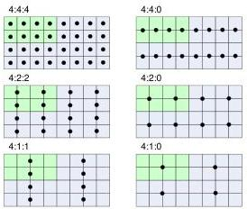

|   |   |   |
| --- | --- | --- |
|  Version 2.4 | Pixel Format Naming Convention  |   |

### 9.2 Centered Positioning

When centered positioning is used, the chroma samples are put mid-way between the chroma samples that have been averaged during the decimation process.

Figure 9-2 : Chroma positioning (centered alignment)

The TIFF file format uses centered chroma sample positioning by default.