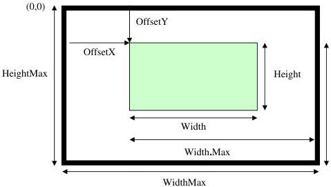

## 4 Image Format Control

This chapter describes how to influence and determine the image size and format. It also provides the necessary information to acquire and to display the image data. It assumes that the device has a Source of data that generates a single rectangular image. This image can be entirely or partially streamed out of the device using one or many Region of interest (ROI).

Figure 4-1: Image size and defining a Region of interest

The sensor provides SensorWidth times SensorHeight pixels.

Using BinningHorizontal and/or BinningVertical or DecimationHorizontal and/or DecimationVertical the image is shrunk to WidthMax times HeightMax pixels.

In addition the features ReverseX and ReverseY can be used to flip the image respectively along the X-axis or Y-axis. The flipping is done before the Region of interest is applied.

Within the shrunk image the user can set a Region of interest using the features OffsetX, OffsetY, Width, and Height. The resulting image generated by the device has Width time Height pixels. OffsetX and OffsetY are given with respect to the upper left corner of the image which has the coordinate (0, 0) (see Figure 4-1). If multiple Regions of interest are supported by the device, the RegionSelector, RegionMode and RegionDestination features can be used to select and control each Region individually. All measures are given in pixel. As a result the values should not change if the PixelFormat changes. For monochrome cameras each pixel corresponds to one gray value. For color camera in raw mode (Bayer pattern, etc.) each pixel corresponds to one pixel in the color mask. For color cameras in RGB mode each pixel corresponds to one RGB triplet. For color cameras in YUV mode each pixel corresponds to one Y value with the associated color information.

The feature Height describes the height of the image in lines. The pixels within a line are contiguous. The lines however may be not contiguous, e.g. in order to yield a DWORD alignment. LinePitch gives the number of bytes separating the starting pixels of two consecutive lines.