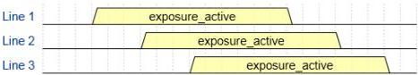
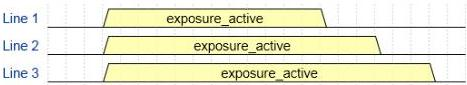

|   |   |  emva  |
| --- | --- | --- |
|  Version 2.7.1 | Standard Features Naming Convention  |   |

- Rolling: The shutter opens and closes sequentially for groups (typically lines) of pixels. All the pixels are exposed for the same length of time but not at the same time.
- GlobalReset: The shutter opens at the same time for all pixels but ends in a sequential manner. The pixels are exposed for different lengths of time.

# Shutter modes diagrams:

Global:

Rolling

Global Reset:

Figure 4-2: Shutter modes diagrams

4.3 SensorTaps

|  Name | SensorTaps  |
| --- | --- |
|  Category | ImageFormatControl  |
|  Level | Optional  |
|  Interface | IEnumeration  |
|  Access | Read/(Write)  |
|  Unit | -  |
|  Visibility | Expert  |
|  Values | OneTwoThreeFour  |