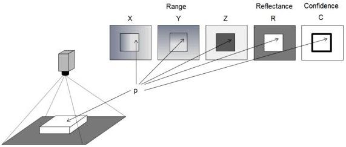

Figure 4-3: Multiple Image components from a full size image

Note that if multiple Components are supported by the device, the **ComponentSelector** can be added to various features such as PixelFormat,.. to specify the characteristics of the selected Component. In order to simplify the standard text and feature descriptions (see above example), the optional **ComponentSelector** is not explicitly propagated to all the features of the SFNC that it can potentially select.

### 4.12 ComponentEnable

|  Name | ComponentEnable[RegionSelector][ComponentSelector]  |
| --- | --- |
|  Category | ImageFormatControl  |
|  Level | Optional  |
|  Interface | IBoolean  |
|  Access | Read/(Write)  |
|  Unit | -  |
|  Visibility | Beginner  |
|  Values | True False  |

Controls if the selected component streaming is active.

Possible values are:

- **True**: Acquisition of component enabled.
- **False**: Acquisition of component disabled.