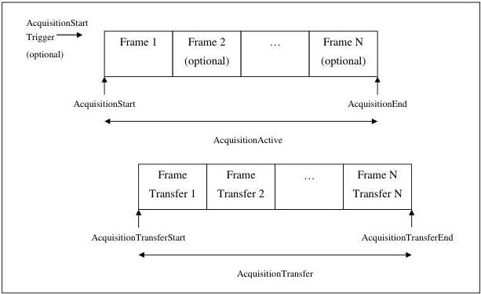

|  GEN<i>CAM |   |  emva  |
| --- | --- | --- |
|  Version 2.7.1 | Standard Features Naming Convention  |   |

## 5 Acquisition Control

The Acquisition Control chapter describes all features related to image acquisition, including the trigger and exposure control. It describes the basic model for acquisition and the typical behavior of the device.

### 5.1 Acquisition related vocabulary and signals

This section describes the vocabulary and terms used to describe and name the acquisition related features. It also defines the acquisition related signals and their position in time during the acquisition of images by a device.

An Acquisition is composed of one or many Frames made of Line(s). The Frames of an Acquisition can optionally be grouped in smaller Bursts that are triggered individually. An Acquisition is defined as the capture of a sequence of one or many Frame(s) (See Figure 5-1).

The transfer of the frame(s) of an Acquisition starts with the beginning of the transfer of the first frame and ends with the completion of the transfer of the last one.

Figure 5-1: Acquisition signals definition