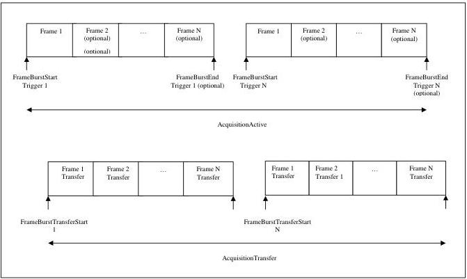

|   |   |   |
| --- | --- | --- |
|  Version 2.7.1 | Standard Features Naming Convention  |   |

A Burst of Frame(s) is defined as the capture of a group of one or many Frame(s) within an Acquisition (See Figure 5-1). If a FrameBurstStart or FrameBurstActive trigger is enabled (its TriggerMode=On), an acquisition can be broken in many smaller Bursts. In this case, each Burst has its own trigger. If only the FrameBurstStart trigger is enabled, AcquisitionBurstFrameCount determines the length of each burst. If the FrameBurstStart and FrameBurstEnd triggers are enabled, they are used to delimit the length of every single burst. If the FrameBurstActive trigger is enabled, it determines the length of each individual burst (the burst lasts as long as the trigger is asserted).

The transfer of the frame(s) of a burst starts with the beginning of the transfer of the first frame of the burst and end with the completion of the transfer of the last one.

Figure 5-2: Burst signals definition