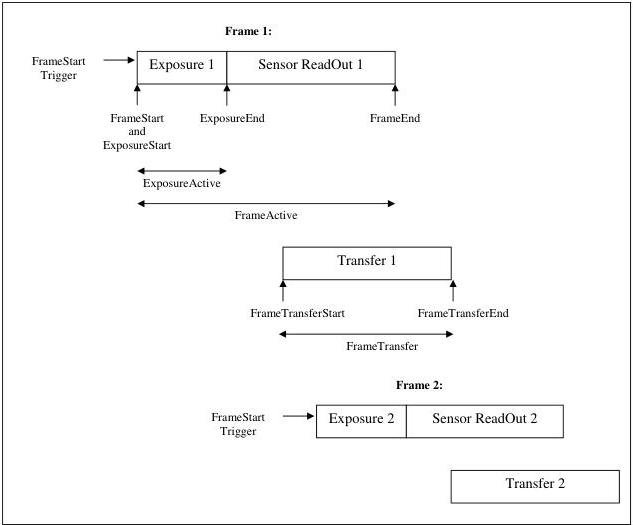

A **Frame** is defined as the capture of **Width** pixels x **Height** lines. A **Frame** starts with an optional **Exposure** period and ends with the completion of the sensor read out. Generally, a transfer period will start during the sensor read out and will finish sometime after it but it is not considered as part of the Frame.

Figure 5-3: Frame signals definition