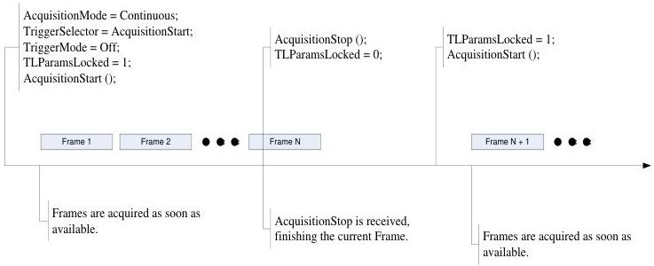

|  GENICAM |   | emva  |
| --- | --- | --- |
|  Version 2.7.1 | Standard Features Naming Convention  |   |

### 5.3 Acquisition timing diagrams

This section gives the timing diagrams and features setting order for the most common acquisition scenarios.

Figure 5-5: Continuous Acquisition