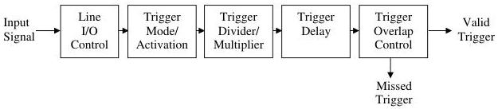

|  GEN<i>CAM |   | emva  |
| --- | --- | --- |
|  Version 2.7.1 | Standard Features Naming Convention  |   |

The drawing below shows the functional model of the trigger generation in SFNC.

It shows the order and the stages that an input signal received on an external line may pass to become a valid trigger (Ex: a FrameTrigger).

Note that the signal received on an external line or generated from an internal circuit is considered a valid trigger for the Acquisition section only after passing all those stages (if they re implemented).

Figure 5-16: Trigger generation functional model.

- Input Signal represents an electrical signal received on an external Line or an internal signal.
- Line I/O Control represents the Line Control Block as described in the Figure 6-1.
- Trigger Mode/Activation represents the effect of the TriggerMode and TriggerActivation features.
- Trigger Divider/Multiplier represents the effect of the TriggerDivider and TriggerMultiplier features.
- Trigger Delay represents the effect of the TriggerDelay feature
- Trigger Overlap Control represents the effect of the TriggerOverlap feature.
- Valid Trigger represents when an incoming signal becomes a valid Trigger.
- Missed Trigger represents when an incoming signal does not become a valid Trigger.

### 5.6.1 TriggerSelector

|  Name | TriggerSelector  |
| --- | --- |
|  Category | AcquisitionControl  |
|  Level | Recommended  |
|  Interface | IEnumeration  |
|  Access | Read/Write  |
|  Unit | -  |
|  Visibility | Beginner  |
|  Values | AcquisitionStart AcquisitionEnd AcquisitionActive FrameStart  |