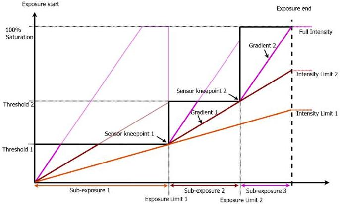

|  GEN<i>CAM |   | emva  |
| --- | --- | --- |
|  Version 2.7.1 | Standard Features Naming Convention  |   |

Figure 5-17: Multi-slope exposure model.

Exposure starts at a level of 0 percent saturation. After the first sub-exposure time, the pixels are only filled by <threshold1> percent of the whole capacity. After the second sub-exposure time, the pixels are filled by <threshold2> percent of the whole capacity. After the third sub-exposure time (which sums up to the total exposure time), exposure is stopped. To maintain the original meaning and behavior of feature ExposureTime, only the n limits between sub-exposures are used and not the n+1 sub-exposure times themselves; the last one results from ExposureTime and the other multi-slope exposure durations.</threshold2></threshold1>

The result of this kind of exposure is shown in the next diagram: