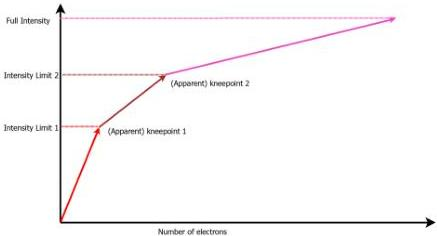

Figure 5-18: Multi-slope Intensity Limits.

The term "knee-point" can be found for either diagram and is determined by different parameters. Nevertheless, the sensor configuration for both knee-points is identical.

## Triggering

Triggering is limited during multi-slope exposure since most of the functionality is handled in the sensor which must usually be pre-configured. Consequently, using TriggerControlled and TriggerWidth ExposureMode is not possible, and using ...End triggers neither. Using ...Start triggers is mainly possible.

Nevertheless, an additional trigger may be provided. A MultiSlopeExposureLimit1 trigger invokes the first change in multi-slope exposure, using all the pre-defined knee-point settings and scaling them to the current length of the first sub-exposure.

## Features

The number of knee-points for multi-slope exposure can be controlled with feature MultiSlopeKneePointCount.

Enabling multi-slope exposure is possible by setting feature MultiSlopeMode to either Manual or to one of the presets.

For Manual configuration, two parameters are necessary for each knee-point, selected by MultiSlopeKneePointSelector. The most obvious parameters are MultiSlopeExposureLimit for controlling the limits between the sub-exposure times, and MultiSlopeSaturationThreshold for the levels/capacities, if allowed by the sensor.

By controlling MultiSlopeExposureLimit in percent of the current ExposureTime, the concrete sub-exposure times adjacent to the selected knee-point are adjusted. Using percentage values allows changes of ExposureTime without changing the proportions of multi-slope exposure.