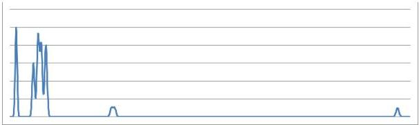
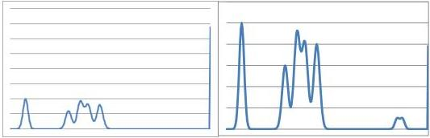

With the additional feature MultiSlopeIntensityLimit, you may directly observe or even control the limit between slopes in your intensity histogram, as will be shown in the next chapter.

With the additional feature MultiSlopeExposureGradient, you may directly observe or even control the gradient of an additional slope as seen in the Figure 5-17: Multi-slope exposure model.

Automatic configuration is also possible by selecting one of three values for MultiSlopeMode, PresetSoft, PresetMedium, and PresetAggressive.

## Example

For illustration of the effects of multi-slope exposure, let's look at the consequences in an artificial illumination scene resulting in the following intensity histogram:

In this histogram (taken at an exemplary ExposureTime of 2000μs), many intensity values are not filled at all, and the ones that are filled are clustered around some spots. The goal of multi-slope exposure is a histogram that allows better segmentation of objects according to their intensity, while still keeping gradations in the bulk of intensities. In this case, two additional exposure slopes are chosen.

For defining multi-slope exposure, start with an exposure time that shows all the low-key intensities (in this example 10000μs), but with enough spare intensities to the right side to accommodate the high-key values that should now appear as top-value intensities like in the left diagram. This is the ExposureTime that you need for your result image.

Then define the parameters for the next slope to get the next intensities into the histogram, again leaving some space to the right (as can be seen in the right diagram).

Finally, define the last slope to get also the highest keys into the histogram like in the following diagram :