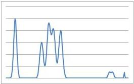
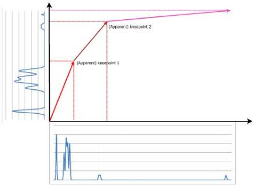

The overall effect may be summarized by the following transformation:

Figure 5-19: Multi-slope exposure example.

For the transformation of the shown diagrams, the following approximate parameters would apply:

MultiSlopeExposureLimit[1]=53,9%, MultiSlopeExposureLimit[2]=97,8%,

MultiSlopeSaturationThreshold[1]=28%, MultiSlopeSaturationThreshold[2]=88,9%.

This results in MultiSlopeIntensityLimit[1] of 52% and MultiSlopeIntensityLimit[2] of 92%, and an MultiSlopeExposureGradient[1] of 1.4 and MultiSlopeExposureGradient[2] of 5.