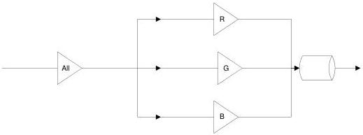

|  GEN<i>CAM |   | emva  |
| --- | --- | --- |
|  Version 2.7.1 | Standard Features Naming Convention  |   |

|   | DigitalRed DigitalGreen DigitalBlue DigitalY DigitalU DigitalV DigitalTap1, DigitalTap2, ...  |
| --- | --- |

Selects which Gain is controlled by the various Gain features.

In general, there are 2 types of gain that can exist in a camera, analog or digital. Some camera will implement one or other or both. This is why there are 3 possible sets of gain.

The first one, without the **Analog** or **Digital** prefix, is to be used when only one type of gain is implemented. This permits to have an implementation independent way to set the gain.

The second and the third, with the **Analog** and **Digital** prefix, is to be used when both types of gain are implemented. This permits to have independent control over each one.

The All gain are intended to be a pre or post stage amplification across all channels or taps, rather than a convenient way to set all the channels or tap gains in a single step.

Figure 6-1: Gain All pre amplification

or